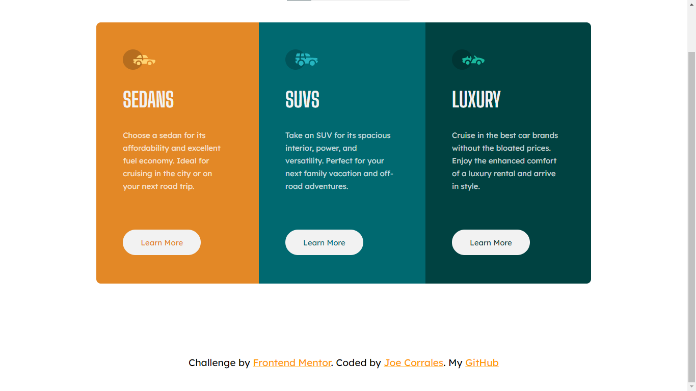

# Frontend Mentor - 3-column preview card component solution

This is a solution to the [3-column preview card component challenge on Frontend Mentor](https://www.frontendmentor.io/challenges/3column-preview-card-component-pH92eAR2-). Frontend Mentor challenges help you improve your coding skills by building realistic projects. 

## Table of contents

- [Overview](#overview)
  - [The challenge](#the-challenge)
  - [Screenshot](#screenshot)
  - [Links](#links)
- [My process](#my-process)
  - [Built with](#built-with)
  - [What I learned](#what-i-learned)
  - [Useful resources](#useful-resources)
- [Author](#author)
- 
## Overview

This layout consists of 3 columns, each column has their own color and SVGs. The challenge is about giving the correct spaces between each element, and try to make the exact same layout. 

I am new in web development so I would appreciate any suggestions or advices!

### The challenge

Users should be able to:

- View the optimal layout depending on their device's screen size
- See hover states for interactive elements

### Screenshot




### Links

- Solution URL: [My Solution](https://www.frontendmentor.io/solutions/moblie-first-html-css-and-sass-PxUkQkKJU)
- Live Site URL: [Live site](https://jcorrales07.github.io/3-card-preview/)

## My process

First, I wrapped every card in a div with a class .cards first-card, second-card, third-card. in every card i place a figure, header, section and footer. and then nested all the elements in their correct place.

In css/sass, I began by putting the normalize.css to have order on it. Then I began to give general styles for the layout (body, container, and variables for te colors and fonts). I began by doing the mobile design and then I only adjust some things for the desktop design.

### Built with

- Semantic HTML5 markup
- CSS
- SASS
- Flexbox
- Mobile-first workflow

### What I learned

What I reinforce was my knowledge about SASS, whenever I need to use a variable I g.$theVariable to make it function, this is because of the new @use rule replacing @import.

```html
All the html
```
```css
.first-card {
  background: g.$orangeBright;
  border-radius: 9px 0 0 9px; 
  .orange {
      color: g.$orangeBright;
      &:hover {
          background: g.$orangeBright;
          color: g.$verylightGray;
      }
  }
}
```


### Useful resources

- [Resource 1](https://www.studytonight.com/sass/sass-use-atrule) - This helped by teaching me how to use @use and @forward in SASS 

## Author

- Frontend Mentor - [@Jcorrales07](https://www.frontendmentor.io/profile/Jcorrales07)
- Instagram - [@jcorralesss_07](https://www.instagram.com/jcorralesss_07/)


